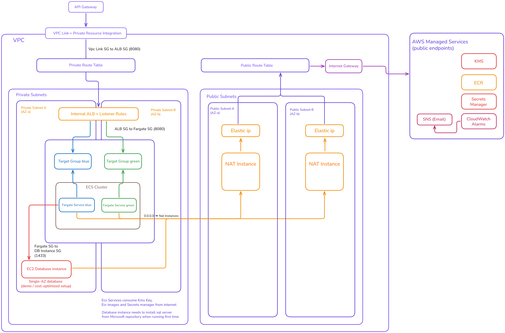
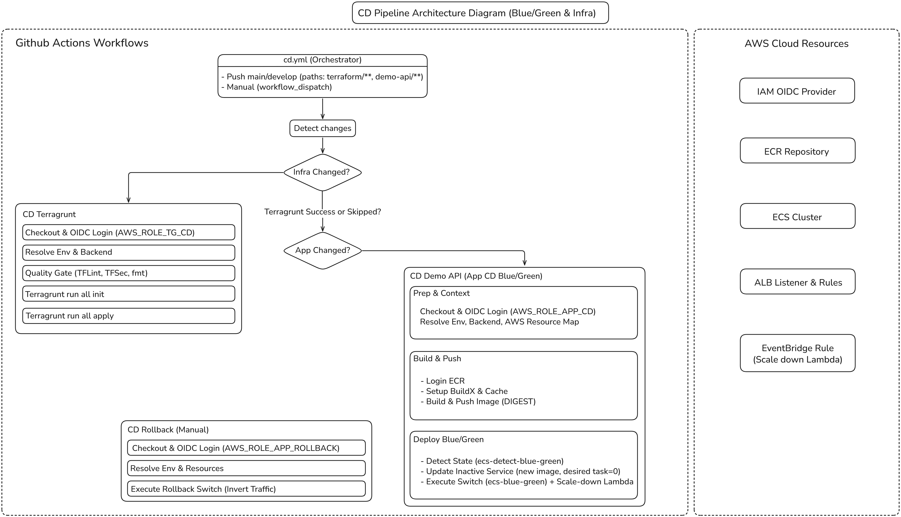

# Architecture Case Study — terragrunt_demo

## Table of Contents

- [1. Executive Summary](#1-executive-summary)
- [2. Problem Statement](#2-problem-statement)
- [3. Requirements](#3-requirements)
  - [3.1 Functional Requirements](#31-functional-requirements)
  - [3.2 Non-Functional Requirements](#32-non-functional-requirements)
  - [3.3 Out of Scope (Intentional)](#33-out-of-scope-intentional)
- [4. High-Level Architecture](#4-high-level-architecture)
  - [4.1 Architecture Overview](#41-architecture-overview)
  - [4.2 Blue/Green Traffic Flow](#42-bluegreen-traffic-flow)
- [5. Key Design Decisions](#5-key-design-decisions)
  - [5.1 GitHub Actions as the CI/CD engine](#51-github-actions-as-the-cicd-engine)
  - [5.2 OIDC-based authentication instead of AWS access keys](#52-oidc-based-authentication-instead-of-aws-access-keys)
  - [5.3 Terraform + Terragrunt for infrastructure orchestration](#53-terraform--terragrunt-for-infrastructure-orchestration)
  - [5.4 Blue/Green deployments using ALB listener rules](#54-bluegreen-deployments-using-alb-listener-rules)
  - [5.5 Health checks as deployment gates](#55-health-checks-as-deployment-gates)
  - [5.6 NAT Instances instead of NAT Gateways](#56-nat-instances-instead-of-nat-gateways)
  - [5.7 Event-driven NAT auto-healing](#57-event-driven-nat-auto-healing)
  - [5.8 API Gateway + VPC Link + internal ALB](#58-api-gateway--vpc-link--internal-alb)
  - [5.9 EC2-based database for MVP and cost control](#59-ec2-based-database-for-mvp-and-cost-control)
  - [5.10 Secrets management and encryption](#510-secrets-management-and-encryption)
  - [5.11 Minimal but focused monitoring](#511-minimal-but-focused-monitoring)
  - [5.12 Extensibility for future microservices](#512-extensibility-for-future-microservices)
- [6. CI/CD Flow](#6-cicd-flow)
  - [6.1 Infrastructure CI (Terragrunt CI)](#61-infrastructure-ci-terragrunt-ci)
  - [6.2 Infrastructure CD (Terragrunt CD)](#62-infrastructure-cd-terragrunt-cd)
  - [6.3 Application CI](#63-application-ci)
  - [6.4 Application CD (Blue/Green Deploy)](#64-application-cd-bluegreen-deploy)
  - [6.5 Manual Rollback Workflow](#65-manual-rollback-workflow)
- [7. Security Model](#7-security-model)
  - [7.1 Identity and Access](#71-identity-and-access)
  - [7.2 Network Security](#72-network-security)
  - [7.3 Practical notes](#73-practical-notes)
- [8. Failure Modes and Recovery](#8-failure-modes-and-recovery)
  - [8.1 Application failures](#81-application-failures)
  - [8.2 Infrastructure failures](#82-infrastructure-failures)
  - [8.3 Data layer failure (known risk)](#83-data-layer-failure-known-risk)
- [9. Future Improvements](#9-future-improvements)
  - [9.1 High-priority improvements](#91-high-priority-improvements)
  - [9.2 Data layer modernization](#92-data-layer-modernization)
  - [9.3 Scaling improvements for high-traffic workloads](#93-scaling-improvements-for-high-traffic-workloads)

## 1. Executive Summary

This case study describes the design and implementation of **terragrunt_demo**, a production-grade AWS platform built to deploy and operate containerized services using **Terraform, Terragrunt and GitHub Actions**.

The system demonstrates how a real-world organization can safely manage **infrastructure-as-code**, **continuous delivery** and **zero-downtime deployments** using a modular, environment-aware architecture that cleanly separates **development** and **production**.

The platform deploys **ECS services behind an Application Load Balancer** using a **blue/green strategy** driven by **ALB listener rule switching**, allowing traffic to be moved between versions with zero downtime and enabling fast, **operator-controlled rollback** when needed.

All infrastructure is managed through **Terraform and Terragrunt**, enabling reproducible environments, dependency orchestration and strict separation of concerns between networking, compute, security and application layers.

The CI/CD pipeline is implemented with **GitHub Actions**, providing a Git-driven workflow where every change to the system — from infrastructure to application versions — is validated, planned and applied in a controlled, auditable and repeatable manner.

Although implemented as a demo, **terragrunt_demo is intentionally designed to mirror a real production platform**.  
Its modular architecture allows components to be replaced, extended or scaled independently, making it suitable as a foundation for microservices, multi-environment SaaS platforms or enterprise workloads.

## 2. Problem Statement

Modern engineering teams need to move fast without sacrificing reliability, security or control.  
However, many real-world projects still start with **manual AWS operations**, ad-hoc deployments and infrastructure created directly in the console.

This leads to several systemic problems:

- Infrastructure is not reproducible
- Deployments depend on human actions
- Rollbacks are slow or risky
- Environments drift over time
- There is no clear audit trail of what changed and why

In the real project that inspired this demo, the initial platform was created directly in AWS using the web console.  
Container images were pushed manually to ECR, and ECS services were updated by clicking “Update service” in the UI.  
Infrastructure changes were applied without version control, making it impossible to reliably recreate environments or safely experiment.

Although this approach allowed the system to reach production, it created growing operational risk:

- A single mistake could break production
- Rolling back was slow and error-prone
- There was no way to test infrastructure changes safely
- Environments could not be cloned or rebuilt

At the same time, the system itself was not trivial.  
It already included:

- A .NET 8 microservice running on ECS Fargate
- Lambda functions
- Application Load Balancer
- API Gateway
- NAT instances
- A database hosted on EC2

This meant the platform was already complex enough that **manual operations were no longer sustainable**, even for a small team.

The goal of **terragrunt_demo** is to solve this exact class of problem.

Instead of starting from a blank slate, it models a realistic production platform and answers a critical question:

> How can a team operate a real AWS-based system with  
> **zero-downtime deployments**,  
> **fast rollbacks**,  
> **auditable changes**  
> and **environment reproducibility**,  
> without relying on manual AWS console actions?

The demo intentionally focuses on the **platform and deployment architecture** rather than business logic.  
It provides a production-grade foundation that can be used for MVPs, SaaS backends or microservice platforms, while keeping costs low and complexity under control.

## 3. Requirements

This section captures the functional and non-functional requirements that guided the design of **terragrunt_demo**.  
While the project is presented as a demo, these requirements intentionally mirror what a real production platform needs in order to be maintainable, auditable and safe to operate.

### 3.1 Functional Requirements

- **Deploy a .NET 8 microservice on ECS Fargate**

  - Build container image
  - Push image to ECR
  - Register a new Task Definition revision
  - Update ECS Service to the new revision

- **Support blue/green deployments via ALB listener rule switching**

  - Maintain two target groups (blue/green)
  - Route production traffic by switching the ALB listener rule to the active target group
  - Keep the previous color alive long enough to allow instant rollback

- **Enable fast rollback**

  - Rollback must be possible in seconds by switching ALB listener rules back to the previous target group (as long as the previous color is still running)

- **Deploy and operate supporting AWS infrastructure for an MVP-grade system**

  - VPC, subnets and route tables
  - Internal ALB with listeners and rules
  - ECS cluster + services + task definitions
  - API Gateway + VPC Link to private integration
  - NAT instances (multi-AZ)
  - EC2 database instance (cost-optimized, single-AZ)
  - IAM roles and policies
  - Secrets Manager / Parameter Store for configuration and secrets
  - CloudWatch alarms and notifications (SNS/email)

- **Use serverless automation for platform operations**

  - NAT auto-healing Lambdas:
    - Assign Elastic IP
    - Update route tables
    - Ensure Source/Destination Check is disabled
  - Blue/green lifecycle Lambda:
    - Scale down the inactive color after a configurable delay (e.g., hours)

- **Support multiple environments**
  - Must support at least **dev** and **prod**
  - Environment must be selected automatically by branch-based rules in GitHub Actions

### 3.2 Non-Functional Requirements

- **No long-lived AWS credentials in CI/CD**

  - GitHub Actions must authenticate to AWS via **OIDC** and assume environment-scoped roles

- **Reproducible environments**

  - The full platform must be created from scratch using **Terraform + Terragrunt**
  - Infrastructure must be consistent across environments through standardized modules and conventions

- **Least privilege IAM**

  - IAM roles must be separated and scoped per environment and purpose (no “one big role”)

- **Blast-radius control through modular design**

  - Infrastructure must be decomposed into clear Terraform/Terragrunt modules (networking, compute, security, etc.)
  - Naming and structure must enable safe iteration and future expansion (e.g., adding new services)

- **Auditability (GitOps workflow)**

  - All changes must be performed through Git history, pull requests and CI/CD logs
  - Direct console-driven changes are considered anti-goals

- **Automatic recovery for critical connectivity components**

  - NAT instances must self-heal using EventBridge-driven automation (to preserve outbound access for private workloads)

- **Deployment performance**
  - Infrastructure CD should complete in ~1–2 minutes
  - Application CD (blue/green deploy + switch) should complete in ~3–4 minutes
  - Rollback should complete in ~20 seconds while the previous color remains alive

### 3.3 Out of Scope (Intentional)

To keep the demo focused and cost-optimized, the following are intentionally excluded, but recommended for a full production implementation:

- Canary deployments / progressive traffic shifting
- Multi-AZ database (e.g., RDS Multi-AZ) and automated DB failover
- Advanced observability (distributed tracing, structured logging pipelines, SLOs)
- Queue-based durability patterns (SQS/event-driven buffering)

## 4. High-Level Architecture

The platform is designed as a **layered, production-grade AWS architecture** that separates networking, traffic management, compute and supporting services while remaining cost-optimized and fully automated.

The diagram below shows the full topology used by **terragrunt_demo**.

### 4.1 Architecture Overview

At a high level, the system is composed of five major layers:

1. **Edge and Access Layer**

   - Public **API Gateway** exposes the API to the internet
   - API Gateway connects privately to the VPC using **VPC Link** and **Private Integration**
   - No ECS services are directly exposed to the public internet

2. **Traffic Management Layer**

   - An **internal Application Load Balancer (ALB)** receives all application traffic
   - ALB listener rules control which color (blue or green) receives production traffic
   - Two **target groups** exist at all times:
     - One active (serving traffic)
     - One inactive (ready for the next deployment)

3. **Compute Layer**

   - The application runs as **ECS Fargate services**
   - Two services are maintained in parallel:
     - `blue`
     - `green`
   - Each service registers in its corresponding ALB target group

4. **Networking and Egress Layer**

   - Workloads run in **private subnets**
   - Outbound internet access is provided by **two NAT instances** (one per AZ)
   - Each NAT instance has:
     - Its own Elastic IP
     - Auto-healing Lambdas to restore routing and connectivity in case of failure

5. **Supporting AWS Services**
   - **ECR** hosts container images
   - **Secrets Manager / SSM** store configuration and credentials
   - **KMS** encrypts secrets and sensitive data
   - **CloudWatch + SNS** provide monitoring and alerting

A cost-optimized **EC2 database instance** is deployed inside the VPC to support the application, with security groups allowing access only from ECS tasks.

---

### 4.2 Blue/Green Traffic Flow

The blue/green deployment model is implemented entirely at the **ALB listener rule level**:

- The **default listener rule** always points to the currently active target group (blue or green)
- The inactive color is connected to a **dummy rule** that receives no traffic
- During a deployment:
  1. The inactive color is updated
  2. Its target group must pass health checks
  3. The ALB listener rule is switched to route traffic to the new color
- If a rollback is needed, the listener rule can be switched back in seconds while the previous color is still running

This approach enables **zero-downtime deployments** with extremely fast rollback, without requiring complex service meshes or external deployment tools.

## 5. Key Design Decisions

This section explains the most important architectural decisions behind **terragrunt_demo**, including why they were chosen, what alternatives were considered and what trade-offs were accepted.

---

### 5.1 GitHub Actions as the CI/CD engine

**Decision**  
Use **GitHub Actions** to implement all CI/CD workflows for infrastructure and application deployments.

**Why**  
GitHub Actions provides tight integration with pull requests, branch protections and code reviews, enabling a true **GitOps workflow**:

- Infrastructure plans run on every PR
- Changes are approved before being applied
- Production changes are triggered only after merges

This makes every change **auditable, reviewable and reversible**.

**Alternatives considered**

- Jenkins
- GitLab CI
- AWS CodePipeline

These options require additional infrastructure or external orchestration. GitHub Actions keeps everything close to the code and the pull request lifecycle.

**Trade-offs**

- GitHub-hosted runners have limited customization
- Complex pipelines require careful YAML design

**Result**  
A clean CI → PR → CD flow that enforces quality gates and human approval for production.

---

### 5.2 OIDC-based authentication instead of AWS access keys

**Decision**  
Use **OIDC (OpenID Connect)** to allow GitHub Actions to assume AWS IAM roles.

**Why**  
OIDC eliminates long-lived credentials and enables:

- Short-lived, scoped AWS access
- Environment-specific permissions
- Full auditability via AWS CloudTrail

Each pipeline has its own IAM role (e.g., infra CI, infra CD, app deploy, rollback), preventing unnecessary privilege sharing.

**Alternatives considered**

- Storing AWS access keys in GitHub Secrets

This was rejected due to rotation complexity and higher risk.

**Trade-offs**

- Slightly more complex IAM setup
- Requires careful ARN scoping

**Result**  
A secure, modern CI/CD authentication model aligned with AWS best practices.

---

### 5.3 Terraform + Terragrunt for infrastructure orchestration

**Decision**  
Use **Terraform** for infrastructure and **Terragrunt** to orchestrate environments, variables and dependencies.

**Why**  
Terraform alone becomes verbose and repetitive when managing multiple environments and layers.  
Terragrunt adds:

- Centralized variable management
- DRY configuration
- Explicit dependency ordering between layers

The platform is organized into clear layers:

- `global` (VPC, ALB, NAT)
- `platform` (ECS cluster)
- `shared` (ECR, IAM, KMS)
- `edge` (API Gateway, VPC Link)
- `data` (database)
- `apps` (ECS services and Lambdas)

**Alternatives considered**

- Plain Terraform with remote state dependencies
- CloudFormation

**Trade-offs**

- Terragrunt adds another tool to learn
- Debugging requires understanding two layers

**Result**  
A modular, scalable and environment-aware infrastructure design.

---

### 5.4 Blue/Green deployments using ALB listener rules

**Decision**  
Implement blue/green deployments by switching **ALB listener rules** between two target groups.

**Why**  
This approach provides:

- Zero-downtime deployments
- Rollback in seconds
- No dependency on external deployment services

Traffic is routed by changing which target group the ALB’s default rule points to.

**Alternatives considered**

- AWS CodeDeploy blue/green
- Weighted target groups
- Service meshes (e.g., App Mesh)
- Rolling updates

**Trade-offs**

- No built-in canary traffic splitting yet
- Full traffic shifts are immediate

**Result**  
A simple, deterministic and extremely fast deployment model that can later evolve to canary releases.

---

### 5.5 Health checks as deployment gates

**Decision**  
Require the new color to pass ALB **target group health checks** (`/health` endpoint) before switching traffic.

**Why**  
This ensures that only a healthy version receives production traffic.

**Alternatives considered**

- Blind traffic switching
- Application-only health without ALB validation

**Trade-offs**

- Does not protect against “false healthy” logic bugs

**Result**  
A minimal but effective safety gate, with a clear path to canary testing in the future.

---

### 5.6 NAT Instances instead of NAT Gateways

**Decision**  
Use **NAT instances** instead of AWS NAT Gateways for outbound traffic from private subnets.

**Why**  
NAT Gateways were cost-prohibitive for a continuously running demo environment.  
NAT instances offer:

- Predictable low cost
- Full control over routing
- Custom auto-healing logic

**Alternatives considered**

- NAT Gateway
- VPC Endpoints only

**Trade-offs**

- Instances have throughput limits
- Require patching and AMI lifecycle management

**Result**  
A cost-efficient, highly available egress layer with self-healing capabilities.

---

### 5.7 Event-driven NAT auto-healing

**Decision**  
Use **EventBridge (EC2 state-change events)** to trigger Lambda functions that:

- Attach Elastic IPs
- Update route tables
- Disable source/destination check

**Why**  
This ensures that when a NAT instance is replaced, connectivity is restored automatically without human intervention.

**Alternatives considered**

- Manual recovery
- CloudWatch-only alarms

**Trade-offs**

- Requires careful coordination between EC2, ASG and Lambda

**Result**  
A resilient, self-healing networking layer.

---

### 5.8 API Gateway + VPC Link + internal ALB

**Decision**  
Expose the system via **API Gateway** connected privately to the VPC through **VPC Link** hooking into an internal ALB.

**Why**  
This provides:

- No public exposure of ECS or ALB
- A future-ready edge for authentication, throttling and WAF
- Secure private connectivity into the VPC

**Alternatives considered**

- Public ALB
- NLB-only exposure

**Trade-offs**

- Slightly higher latency
- More components

**Result**  
A secure and extensible edge architecture.

---

### 5.9 EC2-based database for MVP and cost control

**Decision**  
Use a **single-AZ EC2 database instance**.

**Why**  
The goal is to support an MVP or demo at minimal cost while keeping the architecture realistic.

**Alternatives considered**

- RDS Multi-AZ
- Aurora

**Trade-offs**

- No automatic failover
- Higher operational risk

**Result**  
A pragmatic, low-cost data layer with a clear upgrade path to managed databases.

---

### 5.10 Secrets management and encryption

**Decision**  
Store sensitive values in **AWS Secrets Manager**, encrypted with **KMS**, and inject them into ECS via task definitions.

**Why**  
This avoids plaintext secrets in code or pipelines and enables future rotation and auditing.

**Alternatives considered**

- GitHub Secrets only
- Environment variables

**Result**  
Secure and maintainable secrets handling.

---

### 5.11 Minimal but focused monitoring

**Decision**  
Start with **CloudWatch alarms** for critical availability signals:

- ECS running tasks
- NAT instance health
- Capacity gaps

**Why**  
The demo focuses on platform reliability rather than full observability.

**Alternatives considered**

- Full tracing and log pipelines

**Trade-offs**

- Limited visibility into application-level behavior

**Result**  
A lightweight monitoring baseline with a clear path to advanced observability.

---

### 5.12 Extensibility for future microservices

**Decision**  
Design the platform so additional microservices can be added by duplicating and parameterizing ECS, ECR and pipeline components.

**Why**  
The architecture is modular and built to grow.

**Trade-offs**

- Requires refactoring pipelines into reusable actions or matrices

**Result**  
A platform that scales from one service to many without redesign.

## 6. CI/CD Flow

This platform follows a GitOps workflow implemented with GitHub Actions.  
Infrastructure changes are validated and planned on pull requests, then applied only after merge.  
Application deployments use a blue/green strategy with fast, operator-controlled rollback.

The diagram below summarizes the CD orchestration: a single workflow detects changes, applies infrastructure only when needed, and deploys the application using blue/green switching.

### 6.1 Infrastructure CI (Terragrunt CI)

**Trigger**

- Runs on both:
  - Pushes to feature branches
  - Pull requests targeting `main` or `develop`

**Flow**

1. Detect which infrastructure folders changed
2. Run formatting and static analysis:
   - `terraform fmt`
   - `tflint`
   - `tfsec`
3. Run `terragrunt validate` and `terragrunt plan`
4. Publish the plan output as a GitHub Actions **artifact**

**Notes**

- At current scale, the plan runs for the full repo.
- If the platform grows, the pipeline can be optimized to run per layer/root.

---

### 6.2 Infrastructure CD (Terragrunt CD)

**Trigger**

- Merge into `main` or `develop` (environment is selected automatically by branch rules)

**Flow**

1. Authenticate to AWS via OIDC and assume the environment role
2. Execute `terragrunt apply` following the dependency graph between roots
3. Terraform remote state is stored in S3 with locking via DynamoDB

**Failure handling**

- If `apply` fails mid-run, the DynamoDB lock can remain active and requires manual intervention.
- CI quality gates (tflint/tfsec/plan validation) reduce the likelihood of risky applies.

---

### 6.3 Application CI

**Trigger**

- Runs on feature branches and PRs

**Flow**

- Build the .NET application
- Build the Docker image (no automated tests in the demo)

---

### 6.4 Application CD (Blue/Green Deploy)

**Trigger**

- Runs after merge (based on environment resolution via branch rules)

**Flow**

1. Build Docker image
2. Push image to ECR
3. Register a new ECS Task Definition revision
4. Update the inactive ECS service (blue or green)
5. Wait for target group health checks (`/health`) to become healthy
6. Switch ALB listener rules to route traffic to the new color
7. Schedule a delayed scale-down of the inactive color via Lambda (configurable delay)

**Safety**

- If the new target group never becomes healthy, the switch does not occur.

---

### 6.5 Manual Rollback Workflow

Rollback is intentionally **manual** to avoid accidental traffic flips.

**Flow**

1. Operator triggers the rollback workflow in GitHub Actions
2. The pipeline switches ALB listener rules back to the previous color
3. Rollback time:
   - ~20–30 seconds if the previous color is still running
   - ~3–4 minutes if the previous color must be brought back up

## 7. Security Model

The security model is designed around least exposure, GitOps controls and environment-scoped access.

### 7.1 Identity and Access

**CI/CD access**

- GitHub Actions authenticates to AWS using **OIDC** (no static AWS credentials)
- IAM roles are separated by responsibility:
  - Terragrunt CI
  - Terragrunt CD
  - App CD
  - Rollback

**Secrets**

- GitHub stores only non-AWS secrets (e.g., role ARNs and configuration values)
- Application secrets (e.g., DB connection string) are stored in **AWS Secrets Manager** and injected into ECS via Task Definition secrets
- Lambdas in this demo do not require secrets

**IAM roles**

- Separate IAM roles exist for:
  - ECS tasks
  - Lambda functions
  - CI/CD workflows
  - EC2 (as needed)

### 7.2 Network Security

**Subnet design**

- Two public subnets (for NAT instances) across two AZs
- Two private subnets (for ECS workloads) across two AZs
- ECS tasks run in **private subnets**, not directly exposed to the internet

**Ingress**

- Public entry is through **API Gateway**
- API Gateway connects to the VPC via **VPC Link** and routes to an **internal ALB**
- ECS services are not publicly reachable

**Security groups**

- Dedicated security groups exist for:
  - NAT instances
  - Database instance
  - VPC Link integration
  - ALB
  - ECS/Fargate tasks

### 7.3 Practical notes

- Terragrunt CD currently uses broad permissions (AdministratorAccess) for demo velocity and scope.
- In a production implementation, this would be replaced by environment- and layer-scoped policies (network/data/apps) to enforce strict least privilege.

## 8. Failure Modes and Recovery

The platform is designed to handle common operational failures with minimal downtime and fast recovery paths.

### 8.1 Application failures

**ECS task crash**

- ECS maintains the desired count (set to 1 in the demo)
- If a task stops, ECS schedules a replacement automatically

**Bad deployment**

- If the new color fails health checks, the ALB switch does not occur
- If the new color fails after traffic has been switched:
  - A rollback can be executed manually via GitHub Actions
  - Typical recovery time is under 30 seconds if the previous color is still running

### 8.2 Infrastructure failures

**NAT instance failure**

- NAT instances are managed by an Auto Scaling Group (ASG)
- When an instance is replaced and reaches the `running` state, EventBridge triggers automation Lambdas that:
  - Re-attach Elastic IPs
  - Update route tables
  - Ensure Source/Destination Check is disabled

**Multi-AZ egress**

- NAT is deployed across two AZs
- If one NAT fails, the other remains available for its AZ, while the ASG restores capacity automatically

### 8.3 Data layer failure (known risk)

The demo database runs on a single EC2 instance for cost reasons.  
This introduces a known risk:

- If the database instance fails, recovery may be slow and could involve data loss if backups are not implemented.

In production, this layer should move to managed, highly available storage (e.g., RDS Multi-AZ) and include backup/restore and disaster recovery procedures.

## 9. Future Improvements

The demo is intentionally scoped, but the platform is designed to evolve into a production-grade system with enterprise reliability.

### 9.1 High-priority improvements

- **Canary deployments**

  - Replace full traffic switches with progressive rollout
  - Add automated smoke tests before shifting more traffic
  - Add optional human approval gates for production rollouts

- **Improved observability**
  - Structured application logging
  - Centralized log pipeline
  - Distributed tracing (e.g., OpenTelemetry)
  - Dashboards and SLO-driven alerting

### 9.2 Data layer modernization

- Replace EC2 database with **RDS Multi-AZ** (or Aurora) to enable:

  - Automatic failover
  - Backups and point-in-time recovery
  - Reduced operational burden

- Introduce a migration strategy:
  - Run safe/expand migrations before rollout
  - Avoid destructive schema changes during deployment
  - Use canary traffic + validation before full cutover

### 9.3 Scaling improvements for high-traffic workloads

- Evaluate NAT scaling options:

  - NAT Gateway for managed scale
  - VPC endpoints for AWS service traffic reduction
  - Egress architecture adjustments based on workload patterns

- Improve deployment architecture for multiple microservices:
  - Convert repeated pipeline logic into reusable GitHub composite actions
  - Use matrix strategies to deploy multiple services cleanly
